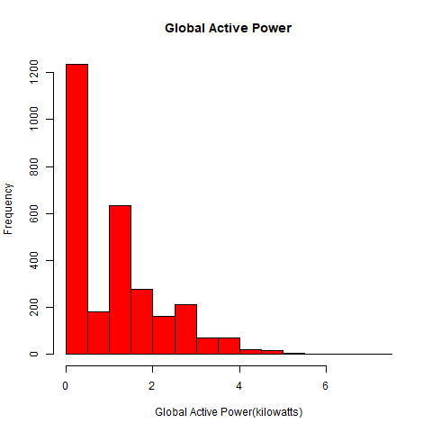
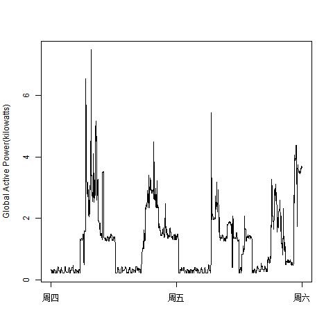
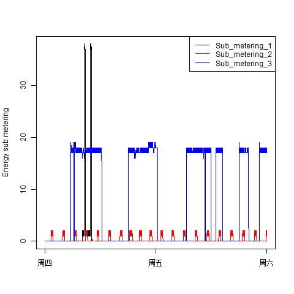
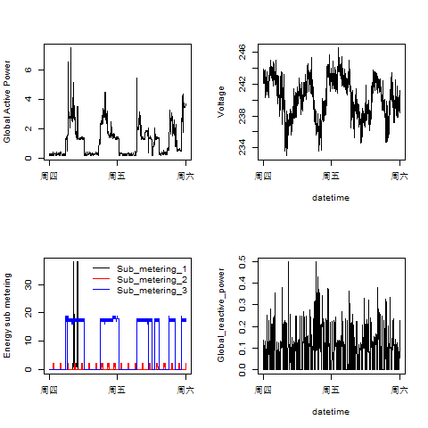

# A short guide
## code
there are four code files, and each R file contains a getdata function and a plot function:
 - plot1.R contains 2 functions: getdata() and plot1()
 - plot2.R contains 2 functions: getdata() and plot2()
 - plot3.R contains 2 functions: getdata() and plot3()
 - plot4.R contains 2 functions: getdata() and plot4()

### get data
the getdata funtions are exactly the same and it has 3 main ideas:
 1. for the purpose of saving memory, it reads the txt file line by line
 2. then create a csv containing needed data
 3. finally it return a variable named data containing needed data

the code is as followed:
``` R
getdata <- function(){
    # set path
    setwd("C:/Users/msgsxj/Desktop/coursera/Exploratory Data Analysis/ExData_Plotting1")

    # get data
    ## create data folder
    if (!file.exists("data")){
        dir.create("data")
    }
    ## cd data
    setwd("./data/")
    ## download data from url
    if (!file.exists("household_power_consumption.zip")){
        url = 'https://archive.ics.uci.edu/ml/machine-learning-databases/00235/household_power_consumption.zip'
        download.file(url, destfile = "./household_power_consumption.zip", method = "curl")
    }
    ## unzip data
    if (!file.exists("household_power_consumption.txt")){
        unzip('household_power_consumption.zip')
    }
    ## if not exist the selected data.csv, create it. 3 steps as followed:
    ## 1. read the original .txt file line by line, it will occupy the least memory
    ## 2. create data_selected.csv, write the feature name line of .txt into .csv
    ## 3. for each line in .txt, if its head match '^[12]/2/2007', concatenate '\n'
    ##    with this line without ' ', write into .csv
    if (!file.exists("data_selected.csv")){
        f <- file("household_power_consumption.txt", "r")
        f_selected <- file("data_selected.csv", "w")
        feature_name <- readLines(f, n = 1)
        cat(feature_name, file = f_selected)
        oneline <- readLines(f, n = 1)
        while(length(oneline) != 0){
            if(length(grep('^[12]/2/2007', oneline, value = T)) != 0){
                value <- paste('\n', oneline, sep="")
                cat(value, file = f_selected)
            }
            oneline <- readLines(f, n = 1)
        }
        close(f_selected)
        close(f)
    }
    ## read selected data
    data <- read.table("data_selected.csv", sep = ";", header = TRUE, stringsAsFactors = F)
    ## convert the Time into time in R
    data$Time <- paste(data$Date, data$Time)
    data <- subset(data, select = -Date )
    data$Time <- strptime(data$Time, "%d/%m/%Y %H:%M:%S")

    # get back to the root path
    setwd("C:/Users/msgsxj/Desktop/coursera/Exploratory Data Analysis/ExData_Plotting1")
    return(data)
}
```
### get plots
you should run the code followed to get the png files.
``` R
source("plot1.R")
source("plot2.R")
source("plot3.R")
source("plot4.R")
plot1()
plot2()
plot3()
plot4()
```
## plots
The four plots that you will need to construct are shown below.


### plot 1





### plot 2




### plot 3




### plot 4



## want more details see READ.md
